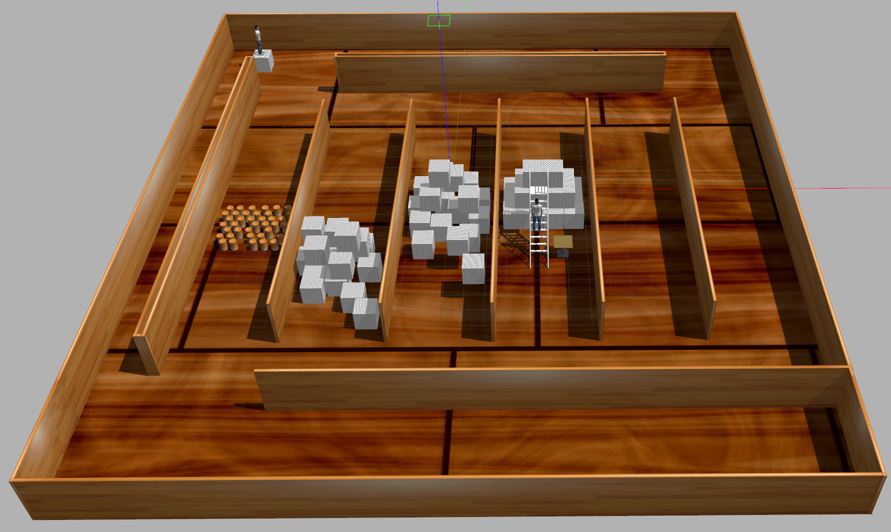

# gazebo_worlds
some collected or created gazebo worlds

---

## exploration_worlds

1. A1_complex.world

  

2. A1_complex18.world

  

3. A1_complex20.world

  

4. A1_upgrade.world

  

5. A1.world

  

6. t1.world

  

7. t1.world

  

8. ZY_world_outdoor8.world

  

9. ZY_world1_simplify.world

  

10. ZY_world1.world

  

